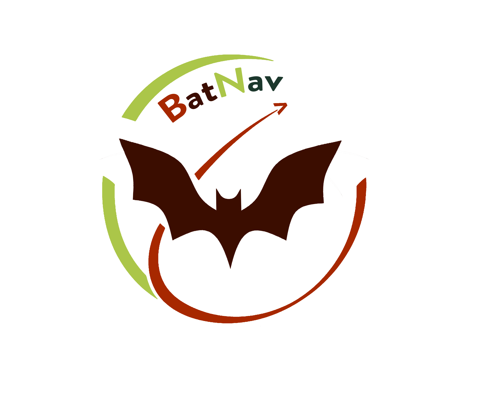
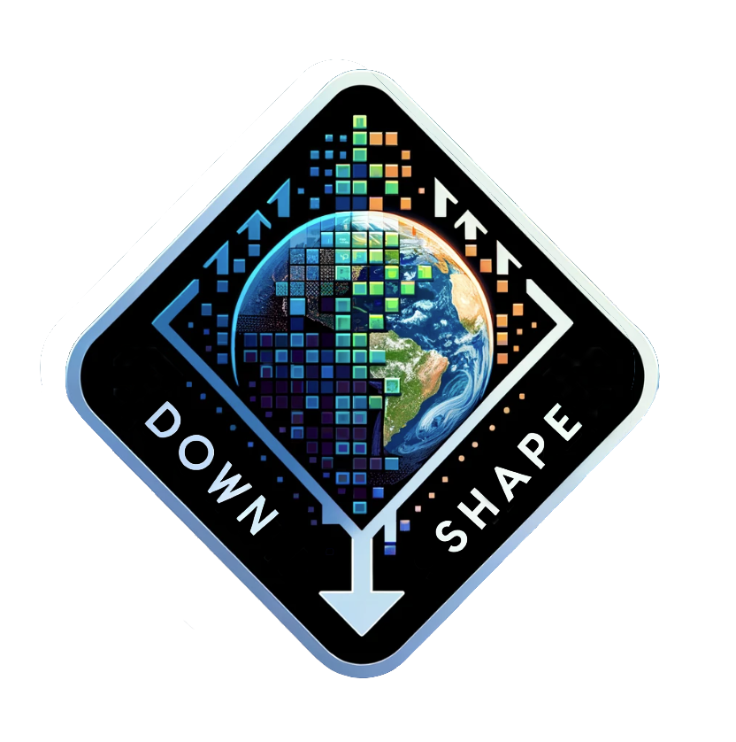
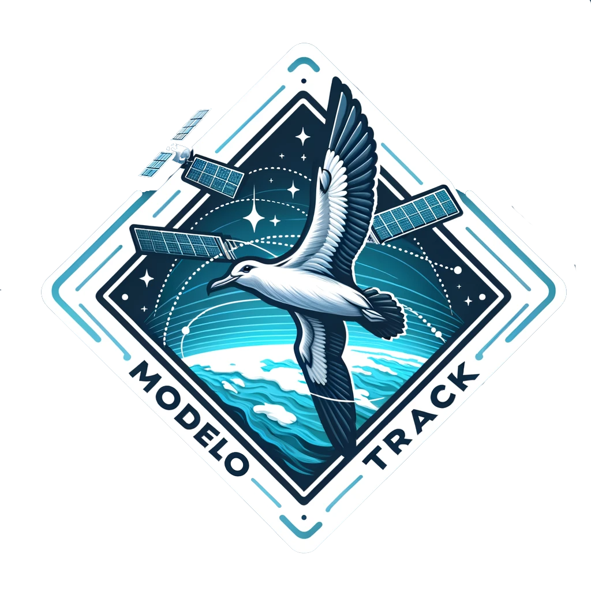
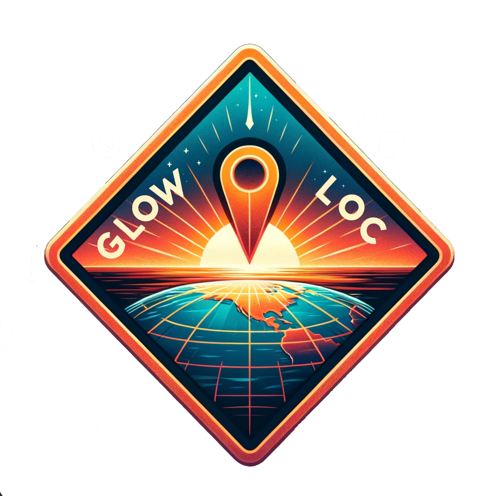

<h2> Hello!  </h2>
  <b class="term" >  I'm a PhD data analyst in ecology at the Centre d'Etudes et de Découverte des Tortues Marines (Indian Ocean, La Réunion - FRANCE) 

 

  
  

 

- :clipboard: I'm working on spatial ecology of turtles :turtle:, bats :bat: and tropical seabirds :bird: with tracking data come from GLS or GPS tags. 
- :mailbox: How to reach me: romain.fernandez@univ-reunion.fr </b>

## :computer: My R programs

 

 

  

     
  

  

  BatNav is an R Shiny application to perform spatial analysis using GPS points of flying foxes recorded by <a href="https://gcoi.org/">GCOI</a>. 
  

  

     
  

  

  This research compendium allows you to download and process CMIP6 and Copernicus data from the ESGF website and the Copernicus API, with CMIP6 variables being bias-corrected. 📩 Send me an email to keep this code.
  

  

     
  

  

  This research compendium enables the creation of habitat models using the biomd2 package, working with environmental data obtained from the downshape compendium. 📩 Send me an email to keep this code.
  

  

     
  

  

    This package enables the creation of geolocation points from GLS twilight data and generates several result reports.
  

